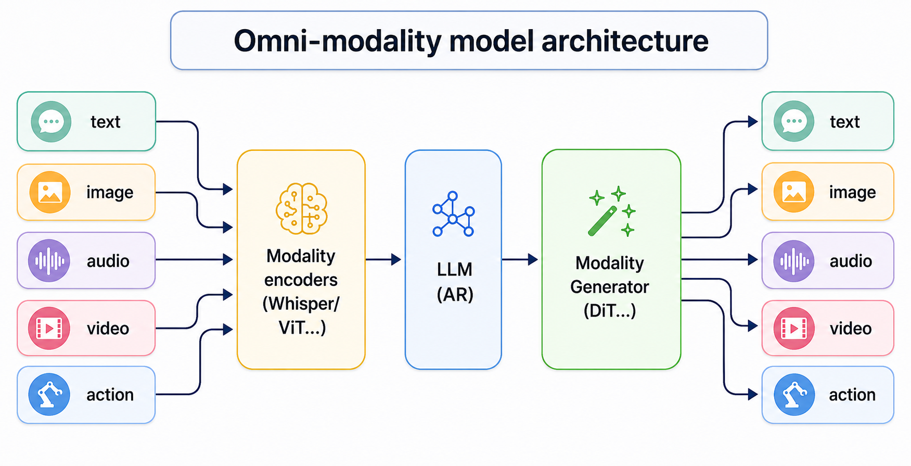

概述
====

简介
----

vLLM-Omni-SUPA 是面向壁仞 BR2XX 的 vLLM Omni 插件，它使得 vLLM Omni 框架可以方便快速地在壁仞 GPU 上运行，无需侵入式修改上游 vLLM 源码。

vLLM-Omni-SUPA 使用 vLLM Omni 提供的 `硬件插件 <https://github.com/vllm-project/vllm-omni/issues/5426>`_ 接口开发，并在部分关键路径上使用 SUPA 内核实现高性能计算。

通过 vLLM-Omni-SUPA，用户可以在壁仞 GPU 上高效运行主流开源大语言模型。

   vLLM-Omni 架构示意图

仓库结构
--------

.. code-block:: text

   vllm-omni-supa/
   ├── csrc/              # C++、CUDA 兼容代码和 SUPA 内核
   ├── vllm_omni_supa/         # Python 插件包和编译扩展
   ├── test/              # 单元、集成和回归测试
   └── docs/              # Sphinx/Doxygen 文档
